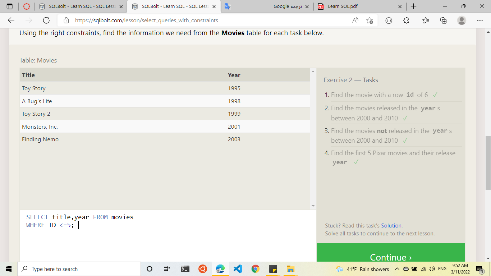
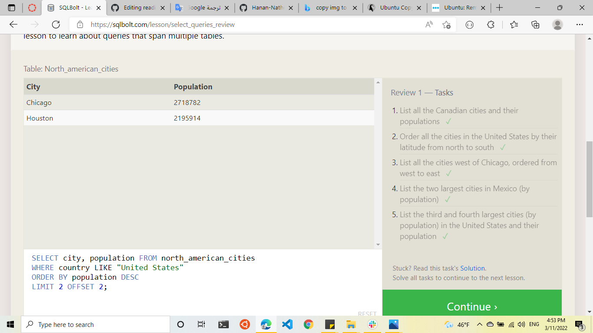
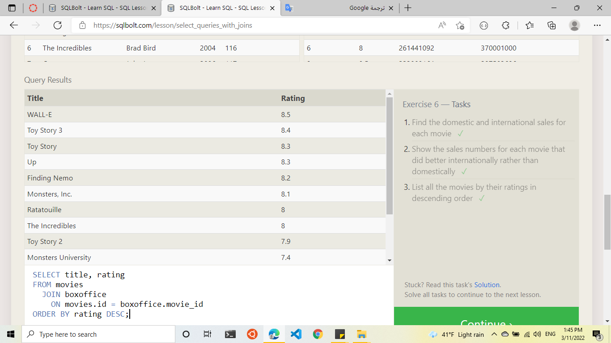
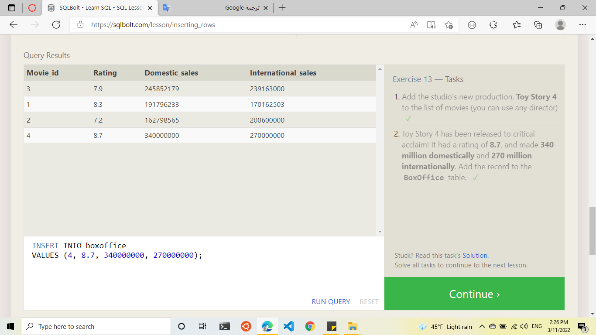
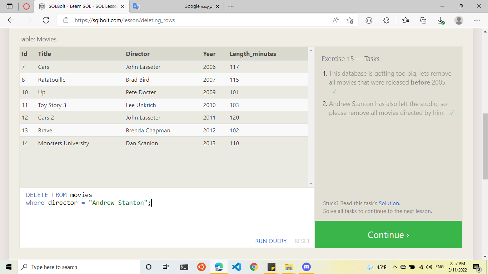
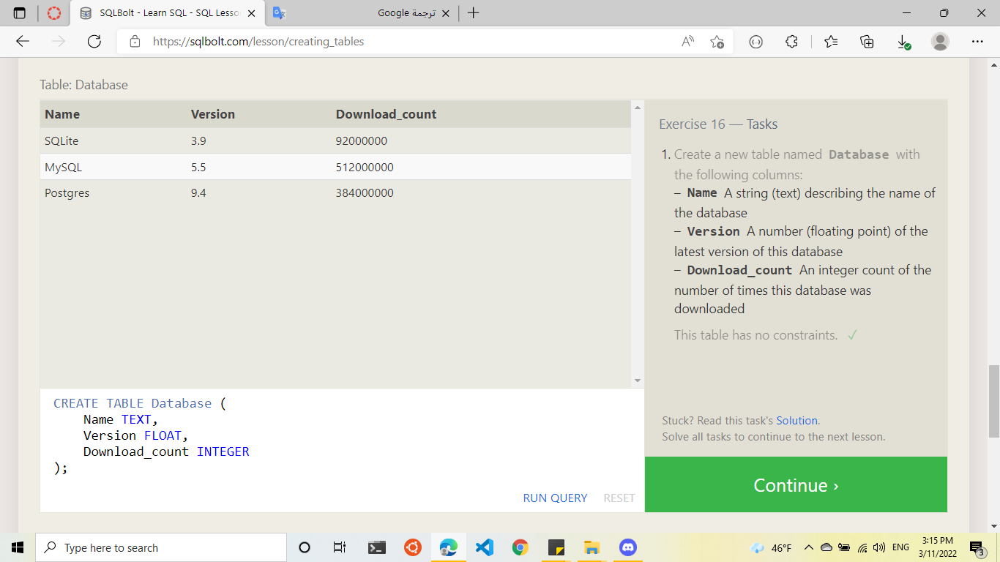
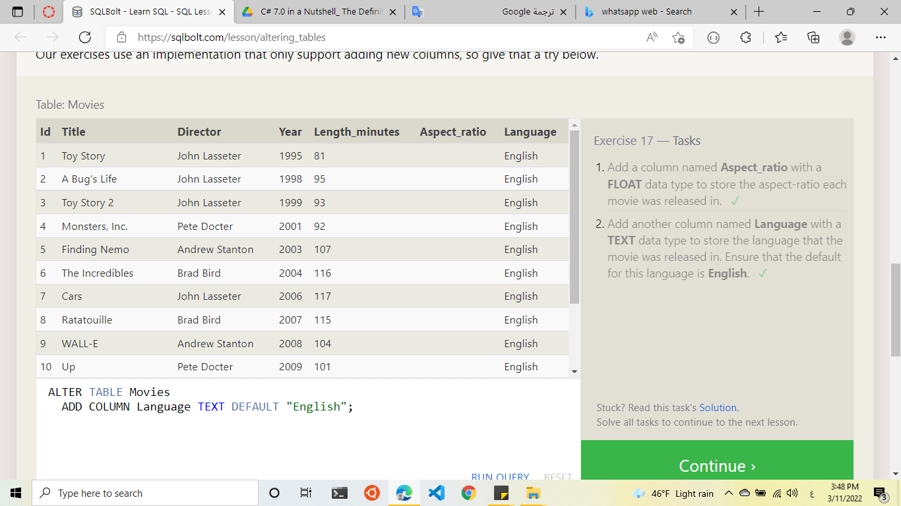

# Introduction to SQL
## Relational databases 
 represents a collection of related (two-dimensional) tables.with a fixed number of named columns and any number of rows of data.
 ## Lesson 1: SELECT queries:
We need to write SELECT statements to retrieve data from a SQL database
**To select specific data from table-> **
```
SELECT column, another_column, …
FROM mytable;
```
**To select all data from table->**
```
SELECT * 
FROM mytable;
```
## Exercise1

---
 ## Lesson 2: Queries with constraints:
Use a WHERE clause to filter data,and applied to each row of data by checking specific column values to determine whether it should be included in the results or not.
```
SELECT column, another_column, …
FROM mytable
WHERE condition
    AND/OR another_condition
    AND/OR …;
```
## Exercise2

---
 ## Lesson 3: Queries with constraints (part2):
text-data specific operators(Examples)
#### =	
#### != or <>
#### LIKE
#### NOT LIKE
#### %
#### IN (…)	
#### NOT IN (…)	
## Exercise3

---
 ## Lesson 4: Filtering and sorting Query results:
#### DISTINCT-> remove duplicate rows.

```
SELECT DISTINCT column, another_column, …
FROM mytable
WHERE condition(s);
```
#### ORDER BY clause -> way to sort your results by a given column in ascending or descending 
```
SELECT column, another_column, …
FROM mytable
WHERE condition(s)
ORDER BY column ASC/DESC;
```
## Exercise4

---
## Lesson 5: Review:
###  practice writing queries that solve actual problems

## Exercise5

---
# Lesson 6: Multi-table queries with JOINs
 Database normalization -> minimizes duplicat data in tables.
Using the JOIN to combine row data across two separate tables using this unique key. 
```
SELECT column, another_table_column, …
FROM mytable
INNER JOIN another_table 
    ON mytable.id = another_table.id
WHERE condition(s)
ORDER BY column, … ASC/DESC
LIMIT num_limit OFFSET num_offset;
```
### Exercise 06

---
# Lesson 13:Inserting rows
INSERT ->  inserting data into a database
```
INSERT INTO mytable
(column, another_column, …)
VALUES (value_or_expr, another_value_or_expr, …),
      (value_or_expr_2, another_value_or_expr_2, …),
      …;
```
### Exercise 13

---
# Lesson 14:Updating rows
A common task is to `update` existing data, ,you have to specify exactly which table, columns, and rows to `update`. In addition, the data you are updating has to match the data type of the columns in the table schema.
```
UPDATE mytable
SET column = value_or_expr, 
    other_column = another_value_or_expr, 
    …
WHERE condition;
```
### Exercise 14

---
# Lesson 15:Deleting  rows
 delete data from a table in the database
```
DELETE FROM mytable
WHERE condition;
```
### Exercise 15

---
# Lesson 16:Creating tables
 create new table
```
CREATE TABLE IF NOT EXISTS mytable (
    column DataType TableConstraint DEFAULT default_value,
    another_column DataType TableConstraint DEFAULT default_value,
    …
);
```
### Exercise 16

---
# Lesson 17:Altering tables
a way to update corresponding tables and database schemas by using the ALTER TABLE statement to add, remove, or modify columns and table constraints.
```
ALTER TABLE mytable
ADD column DataType OptionalTableConstraint 
    DEFAULT default_value;
```
```
ALTER TABLE mytable
DROP column_to_be_deleted;
```
```
ALTER TABLE mytable
RENAME TO new_table_name;
```
### Exercise 17

---
# Lesson 18:Dropping tables
 remove an entire table including all of its data and metadata
```
DROP TABLE IF EXISTS mytable;
```
### Exercise 18

