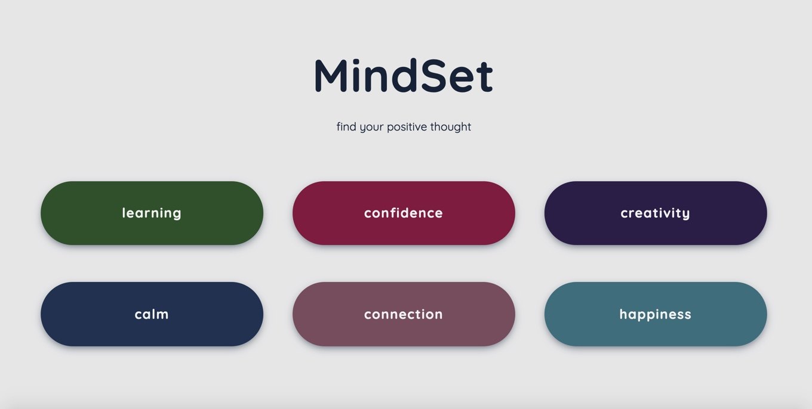

# Mindset:

* Deliberate Practice — The Fastest Way to Improve Your Skills
    - You can be the best in anything in your life by practicing well.
    - you can try any new skill in 1 hour. You can learn some of the basics in 10 hours. You can become very good in 100 hours.
And you can become amazing in most skills, if you spend 1000 hours of quality practice.
    - The best in the world in any domain are masters at maximizing how much they get out of each hour they practice. And their practice does not look anything like recreation.
    - It requires your full attention, motivation to learn, feedback on how you are doing, high effort and many repetitions.
* Grit: The power of passion and perseverance
    - Don't let setbacks discourage you. don't give up easily.
    - you have to be  a hard worker.
* think like a programmer — lessons in problem solving:
    -  problem-solving skills the most important qualification that employers look for.
    -  steps to encounter a new problem: understand ->  plan ->  divide -> stuck ->  practice, practice, practice.
 
* To be like the best you need to take criticism like the best that's why we need to take as much feedback as we can even if it's on the harsher side to improve us or to see the perspective of others.
# finally I discovered after reading these recources  that I had a fixed mindset when I was having a problem holding back and giving up, but I solved the problem through stimulation and found solutions to this problem .
