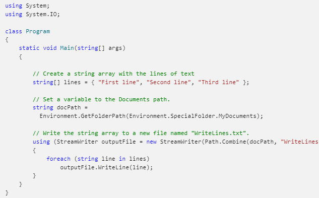
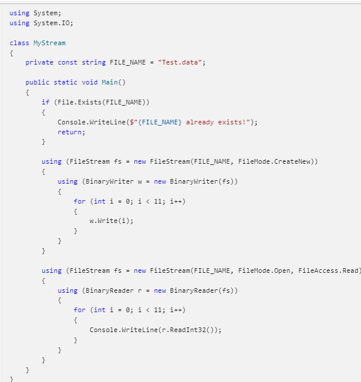

# System.I.O
## File and Stream I/O
It is transfer of data either to or from a storage medium.
### the System.IO namespaces
* contain types that enable reading and writing, both synchronously and asynchronously, on data streams and files.
* contain types that perform compression and decompression on files, and types that enable communication through pipes and serial ports.
## Files and directories :

**Common Classes:**
* File     ===>  provides static methods for creating, copying, deleting, moving, and opening files, and helps create a FileStream object.
* FileInfo   ===>  provides instance methods for creating, copying, deleting, moving, and opening files, and helps create a FileStream object.
* Directory    ===>  provides static methods for creating, moving, and enumerating through directories and subdirectories.
* DirectoryInfo   ===>  provides instance methods for creating, moving, and enumerating through directories and subdirectories.
* Path     ===> provides methods and properties for processing directory strings in a cross-platform manner.

## Streams
* supports reading and writing bytes..
* provide a common view of data sources and repositories, and isolate the programmer from the specific details of the operating system and underlying devices.

**fundamental operations**
* Reading - transferring data from a stream into a data structure, such as an array of bytes.
* Writing - transferring data to a stream from a data source.
* Seeking - querying and modifying the current position within a stream.

***Common Classes:***
* FileStream ===> for reading and writing to a file.
* IsolatedStorageFileStream ===> for reading and writing to a file in isolated storage.
* MemoryStream ===> for reading and writing to memory as the backing store.
* PipeStream ===> for reading and writing over anonymous and named pipes.
## Readers and writers:
**Common Classes:**
* BinaryReader and BinaryWriter ===> for reading and writing primitive data types as binary values.
* StreamReader and StreamWriter ===> for reading and writing characters by using an encoding value to convert the characters to and from bytes.
* StringReader and StringWriter ===> for reading and writing characters to and from strings.
* TextReader and TextWriter ===> serve as the abstract base classes for other readers and writers that read and write characters and strings, but not binary data.
## Asynchronous I/O operations:
**With  synchronous I/O operations, the UI thread is blocked until the resource-intensive operation has completed.**
You should perform tasks asynchronously if your application needs to remain responsive to the user.and to prevent creating the impression that your app has stopped working.
## Compression
* Compression refers to the process of reducing the size of a file for storage. 
* Decompression is the process of extracting the contents of a compressed file so they are in a usable format.
 
**The following classes are frequently used when compressing and decompressing files and streams:**
* ZipArchive ===> for creating and retrieving entries in the zip archive.
* ZipArchiveEntry ===> for representing a compressed file.
* ZipFile ===> for creating, extracting, and opening a compressed package.

## Isolated storage
is a data storage mechanism that provides isolation and safety by defining standardized ways of associating code with saved data. 
- Isolated storage is particularly useful when your application does not have permission to access user files.
- You can save settings or files for your application in a manner that is controlled by the computer's security policy.
**The following classes are frequently used when implementing isolated storage:**

* IsolatedStorage – provides the base class for isolated storage implementations.
* IsolatedStorageFile – provides an isolated storage area that contains files and directories.
* IsolatedStorageFileStream - exposes a file within isolated storage.
## Write to a file
Common classes -> StreamWriter , file, Path.

[Writing to a file](https://docs.microsoft.com/en-us/dotnet/standard/io/how-to-write-text-to-a-file)
Example:

From Microsoft Docs

## Reading to a File
The System.IO.BinaryWriter and System.IO.BinaryReader classes are used for writing and reading data other than character strings.

[Reading to a File](https://docs.microsoft.com/en-us/dotnet/standard/io/how-to-read-and-write-to-a-newly-created-data-file)
example:

[BACK TO MY READING NOTE](/README.md)

