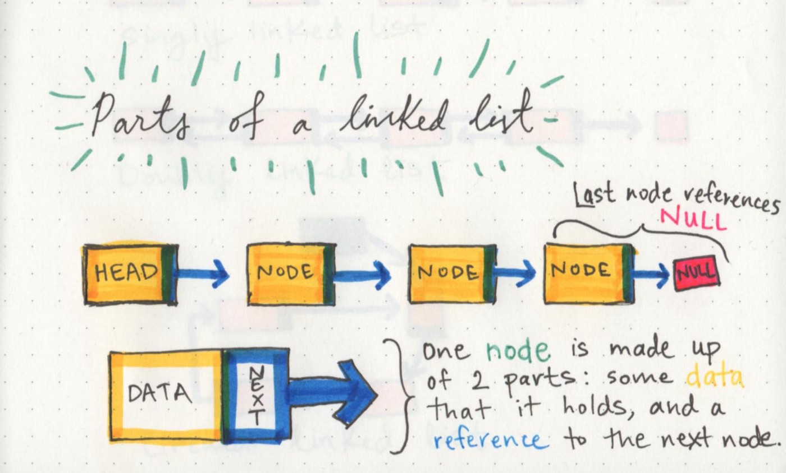
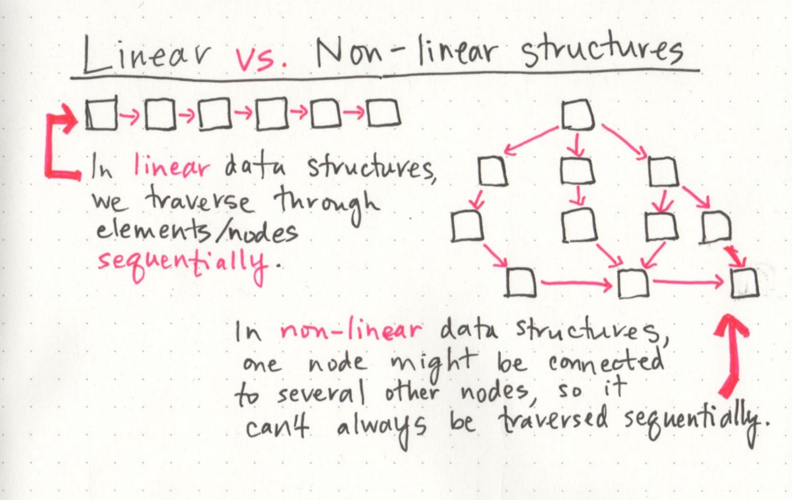

# Read: Linked Lists
## 1- Big O: Analysis of Algorithm Efficiency
- Big O(oh) notation is used to describe the efficiency of an algorithm or function. it based on 2 factors:(Running Time,Memory Space).
- Big O’s role in algorithm efficiency is to describe the Worst Case of efficiency an algorithm can have in performing it’s job. 
- 4 Key Areas for analysis:
     * Input Size : use the letter n to refer to it.
     * Units of Measurement:
         * Three Measurements of time: milliseconds ,operations ,Basic Operations.
         * Four Sources of Memory Usage during function run-time : code for the algorithm,input ,output ,working space.
     * Orders of Growth : 
     
     * Best Case, Worst Case, and Average Case:
        * Worst Case: The efficiency for the worst possible input of size n.
        * Best Case: The efficiency for the best possible input of size n.
        * Average Case: The efficiency for a “typical” or “random” input of size n.
   
    **Basic asymptotic**
    
    
    ---
    # 2- Linked Lists
    
    
   ### What is a Linked List
    - A Linked List is a sequence of Nodes that are connected/linked to each other.
    - there are two type : singly and doubly.
    ### Terminology
    -  each Node references the next Node in the link.
    - Singly refers to the number of references the node has. A Singly linked list means that there is only one reference.
    - Nodes are the individual items/links that live in a linked list. Each node contains the data for each link.
    - Each node contains a property called Next. This property contains the reference to the next node.
    - The Head is a reference of type Node to the first node in a linked list.
    - The Current is a reference of type Node to the node that is currently being looked at.
   ### Traversal
     - we cant use any loop we use the next property.
     - the best way to travel its while loop .
     - first we must look to the head then loop.
     
    ### Traversal Big O
    - Big O of time for Includes would be O(n). This is because, at its worse case, the node we are looking for will be the very last node in the linked list.
    - The Big O of space for Includes would be O(1). This is because there is no additional space being used than what is already given to us with the linked list input.
   ### Adding a Node
1- Adding O(1) =+=> first we connect new node with the head and make its point ot the previous head ==>  we disconnect the head on previous node .

2- Adding a Node O(n) ===> first we create the new node ===> we move to the O(n) node we want to add we make the previous node point to the new node and make he new node point to the next node .
## What’s a Linked List, Anyway? [Part 1]
1- Part of the linked list

2- Linear data structures

3- Memory management

## What’s a Linked List, Anyway? [Part 2]
BigO notation.
- O(1) is what you want. Constant time.
- O(n) will take as long as the number of elements O(n^2) will take exponentially as long as the number of elements.
- You can't search quickly through a linked-list. It will also take a long time to add something to the end of the list, because you have to travel through the entire list to get there.
- They aren't the answer to all you needs, but they are good for adding things to the beginning, and are dynamic. Arrays are OK too.

  
    
        
