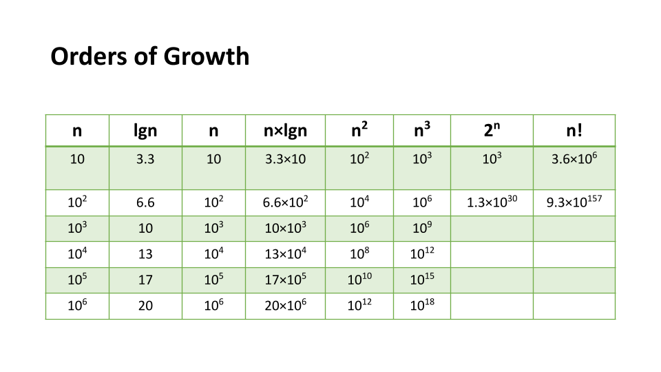
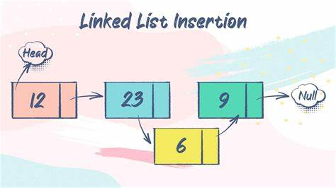

# Read: Linked Lists
## 1- Big O: Analysis of Algorithm Efficiency
- Big O(oh) notation is used to describe the efficiency of an algorithm or function. it based on 2 factors:(Running Time,Memory Space).
- Big O’s role in algorithm efficiency is to describe the Worst Case of efficiency an algorithm can have in performing it’s job. 
- 4 Key Areas for analysis:
     * Input Size : use the letter n to refer to it.
     * Units of Measurement:
         * Three Measurements of time: milliseconds ,operations ,Basic Operations.
         * Four Sources of Memory Usage during function run-time : code for the algorithm,input ,output ,working space.
     * Orders of Growth : 
     
     * Best Case, Worst Case, and Average Case:
        * Worst Case: The efficiency for the worst possible input of size n.
        * Best Case: The efficiency for the best possible input of size n.
        * Average Case: The efficiency for a “typical” or “random” input of size n.
   
    **Basic asymptotic**
    
    
    ---
    # Linked Lists
    
    
    
    - A Linked List is a sequence of Nodes that are connected/linked to each other.
    -  each Node references the next Node in the link.
    - Singly refers to the number of references the node has. A Singly linked list means that there is only one reference.
    - Nodes are the individual items/links that live in a linked list. Each node contains the data for each link.
    - Each node contains a property called Next. This property contains the reference to the next node.
    - The Head is a reference of type Node to the first node in a linked list.
    - he Current is a reference of type Node to the node that is currently being looked at.
    - 
    
        
