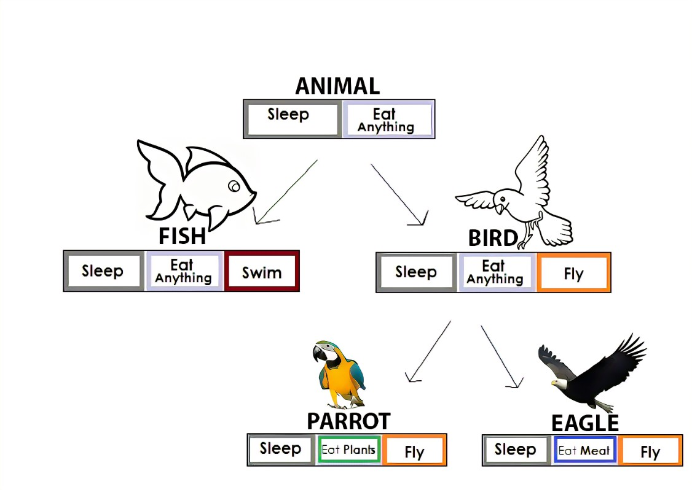

# Object Oriented Principles (OOP) :
 The primary characteristics of object-oriented programming :
 - Inheritance.
 - encapsulation.
 - polymorphism.
    
**Inheritance** ==> enables you to create new classes that reuse, extend, and modify the behavior defined in other classes.

**base class** ==> The class whose members are inherited.

**derived class** ==> 
- the class that inherits those members.
- the derived class implicitly gains all the members of the base class except for its constructors and finalizers.
- The derived class reuses the code in the base class without having to reimplement it.
- You can add more members in the derived class.
- The derived class extends the functionality of the base class.

**direct base class** ==> A derived class can have only one direct base class.

---
  **Example**
  
  base class ==> Animal
  
  derived class ==> Mammal and Reptile.
  
  
  
