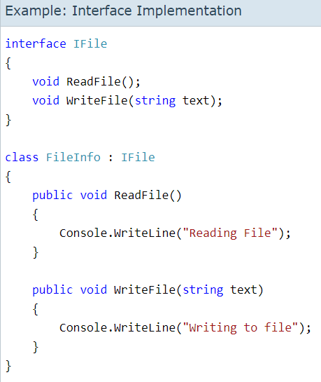

# Interfaces

Interfaces are like abstract classes.They only contain abstract elements and any class that implements them MUST use all thier members. Again Like abstract classes, they can't be instantiated.
Classes can use multiple interfaces, but as we know cannot inherit from more than one interface.

- An interface contains definitions for a group of related functionalities that a non-abstract class or a struct must implement.
- An interface may define static methods, which must have an implementation.
- an interface may define a default implementation for members.
- An interface may not declare instance data such as fields, auto-implemented properties, or property-like events.
- you must use an interface if you want to simulate inheritance for structs, because they can't actually inherit from another struct or class.

**define an interface by using the interface keyword**
```
interface IEquatable<T>
{
    bool Equals(T obj);
}
```
  - A class or struct can implement multiple interfaces, but a class can only inherit from a single class.
  - terfaces can contain instance methods, properties, events, indexers, or any combination of those four member types.
  - In Interfaces may contain static constructors, fields, constants, or operators.
  -  Interface members are public by default, and you can explicitly specify accessibility modifiers, such as public, protected, internal, private, protected internal, or private protected.  
  - A class or struct that implements an interface must provide an implementation for all declared members without a default implementation provide by the interface.
  - 
  
  
  
  # Interface References
- In C#, you are allowed to create a reference variable of an interface type or in other words, you are allowed to create an interface reference variable.
- Such kind of variable can refer to any object that implements its interface.
- An interface reference variable only knows that methods which are declared by its interface declaration.
- It does not allow accessing any other variables or methods that might be supported by the objects.

  
