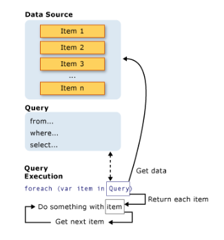

# LINQ & Delegates
---
### LINQ : (Language-Integrated Query)
- a set of technologies based on the integration of query capabilities directly into the C# language.
- The LINQ family of technologies provides a consistent query experience for objects (LINQ to Objects), relational databases (LINQ to SQL), and XML (LINQ to XML).
-  Query expressions are written in a declarative query syntax. By using query syntax, you can perform filtering, ordering, and grouping operations on data sources with a minimum of code.
-  As a rule when you write LINQ queries, we recommend that you use query syntax whenever possible and method syntax whenever necessary. 
-  The variables in a query expression are all strongly typed.

**There are three parts to a query operation**

- Get the Data Source
- Create the Query
- Execute the Query.

### complete query operation:



## Query execution

```
foreach (int num in numQuery)
{
    Console.Write("{0,1} ", num);
}
```
### Basic LINQ Query Operations

You can

### Order 
will cause the elements in the returned sequence to be sorted according to the default comparer for the type being sorted.
```
var queryLondonCustomers3 =
    from cust in customers
    where cust.City == "London"
    orderby cust.Name ascending
    select cust;
```
    
## Filter

causes the query to return only those elements for which the expression is true. The result is produced by using the where clause. The filter in effect specifies which elements to exclude from the source sequence.

```
var queryLondonCustomers = from cust in customers
                           where cust.City == "London"
                           select cust;
```
## Group
 enables you to group your results based on a key that you specify.
 ```
 `// queryCustomersByCity is an IEnumerable<IGrouping<string, Customer>>
  var queryCustomersByCity =
      from cust in customers
      group cust by cust.City;

  // customerGroup is an IGrouping<string, Customer>
  foreach (var customerGroup in queryCustomersByCity)
  {
      Console.WriteLine(customerGroup.Key);
      foreach (Customer customer in customerGroup)
      {
          Console.WriteLine("    {0}", customer.Name);
      }
 ```
## Join
 create associations between sequences that are not explicitly modeled in the data sources. 
 ```
 var innerJoinQuery =
    from cust in customers
    join dist in distributors on cust.City equals dist.City
    select new { CustomerName = cust.Name, DistributorName = dist.Name };
 ```
 
## Select

produces the results of the query and specifies the "shape" or type of each returned element. 

