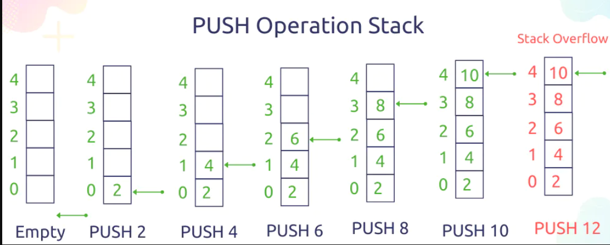
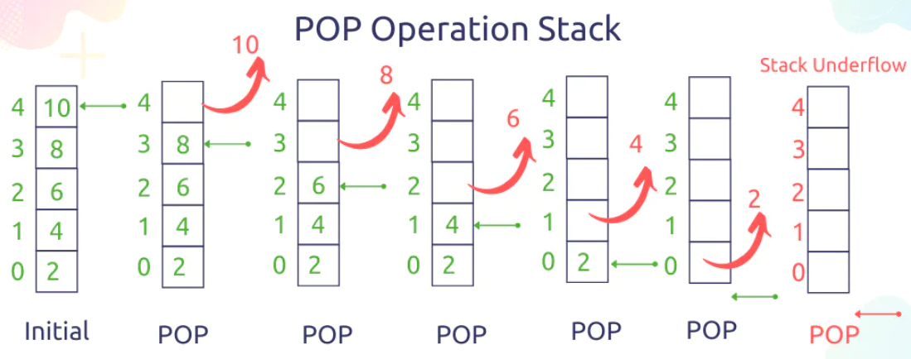

# Stacks and Queues
## Stack
- is a data structure that consists of Nodes
- Each Node references the next Node in the stack, but does not reference its previous.
**Stack terminology**
- Push ==> Nodes or items that are put into the stack are pushed.
- Pop ==> Nodes or items that are removed from the stack are popped.
- Top ==> This is the top of the stack.
- Peek ==> When you peek you will view the value of the top Node in the stack.
- IsEmpty ==> returns true when stack is empty otherwise returns false.

**Stacks follow these concepts:**

### (FILO && LIFO)

## Push O(1)

## POP O(1)

