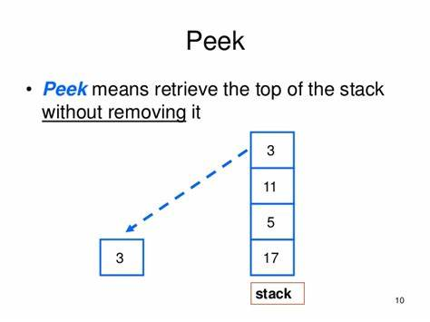
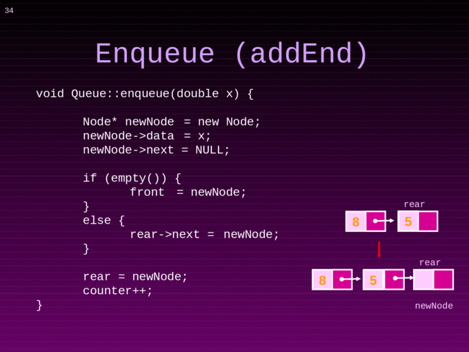
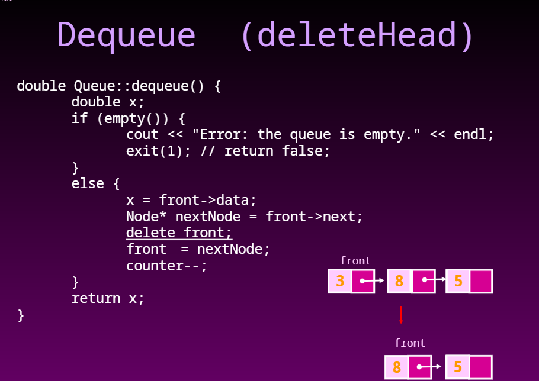

# Stacks and Queues
## Stack
- is a data structure that consists of Nodes
- Each Node references the next Node in the stack, but does not reference its previous.
**Stack terminology**
- Push ==> Nodes or items that are put into the stack are pushed.
- Pop ==> Nodes or items that are removed from the stack are popped.
- Top ==> This is the top of the stack.
- Peek ==> When you peek you will view the value of the top Node in the stack.
- IsEmpty ==> returns true when stack is empty otherwise returns false.

**Stacks follow these concepts:**

### (FILO && LIFO)

### Push O(1)

### POP O(1)

### Peek O(1)

## Queue

**Queue terminology**

- Enqueue ==>  Nodes or items that are added to the queue.
- Dequeue ==> Nodes or items that are removed from the queue.
- Front ==> This is the front/first Node of the queue.
- Rear ==> This is the rear/last Node of the queue.
- Peek ==> When you peek you will view the value of the front Node in the queue.
- IsEmpty ==> returns true when queue is empty otherwise returns false.

### Enqueue

### Dequeue

