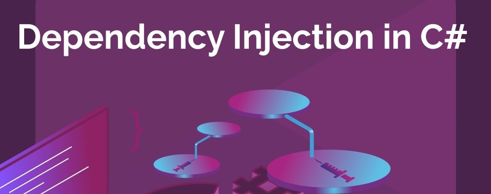
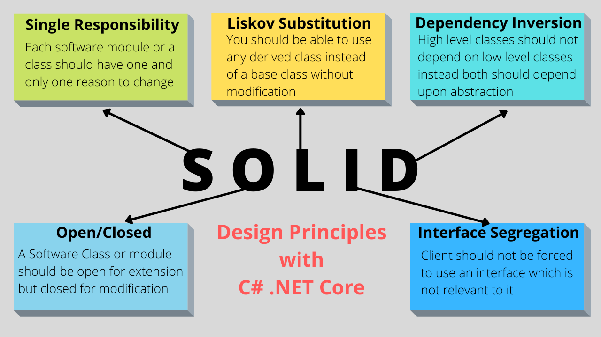

# Readings: Dependency Injection & Repository Design Pattern

## dependency injection (DI) 
- software design pattern, which is a technique for achieving Inversion of Control (IoC) between classes and their dependencies.
- A dependency is an object that another object depends on.
- A class can create an instance of the MyDependency class to make use of its WriteMessage method. 
- Example of adding interface dependency
services.AddScoped<IMyDependency, MyDependency>();
- By using the DI pattern, the controller or Razor Page:
    - Doesn't use the concrete type MyDependency, only the IMyDependency interface it implements. That makes it easy to change the implementation without modifying the controller or Razor Page.
    - Doesn't create an instance of MyDependency, it's created by the DI container.
 -  Each requested dependency in turn requests its own dependencies.
 - The container resolves the dependencies in the graph and returns the fully resolved service.
 - The collective set of dependencies that must be resolved is typically referred to as a dependency tree, dependency graph, or object graph.
 ## Service lifetimes
To use scoped services in middleware, use one of the following approaches:
   - Inject the service into the middleware's Invoke or InvokeAsync method. Using constructor injection throws a runtime exception because it forces the scoped service to behave like a singleton. 
   - Use Factory-based middleware. Middleware registered using this approach is activated per client request (connection), which allows scoped services to be injected into the middleware's constructor.
   ## The Repository pattern
   - Repositories are classes or components that encapsulate the logic required to access data sources.
   - They centralize common data access functionality, providing better maintainability and decoupling the infrastructure or technology used to access databases from the domain model layer.
   - A repository performs the tasks of an intermediary between the domain model layers and data mapping, acting in a similar way to a set of domain objects in memory. 
- For each aggregate, we should create a repository class. This microservice based on Domain-Driven Design(DDD) patterns, the only channel you should use to update the database should be the repositories.
- One should define one repository for each aggregate root. This is to achieve the goal of the aggregate root to maintain transactional consistency between all oth objects within the aggregate.

## repository-aggregate-database-table-relationships

## SOLID

- Single Responsibility Principle.

- One method == One reason to change.

- Open/Close Principle

- Method/Class should be open for extention, closed for modification

- Liskov Substitution Principle

- An Object in an application should be able to be replaced with a type derived from it withough breaking the application. Should be able to use type <Animal> and also use <Dog> and <CAT> that derive from it.

- Interface Segregation Principle

- People should not be forced to rely on interfaces they do not use.

- Dedendency Inversion Principle

- Code should depend on Abstractions not concrete implementations.

## SOLID Principles in Pictures

