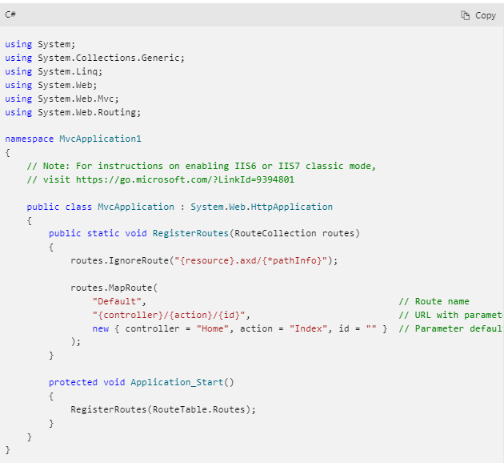
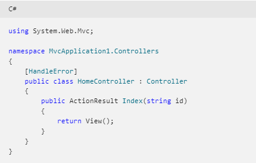
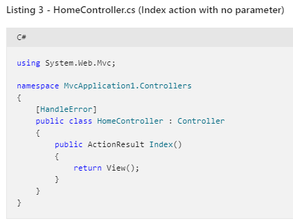
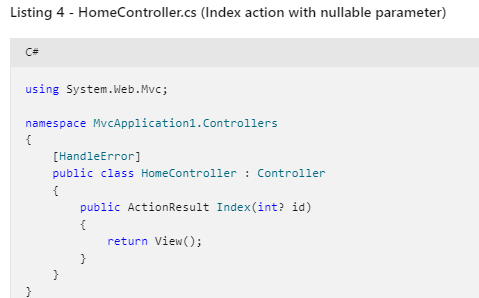
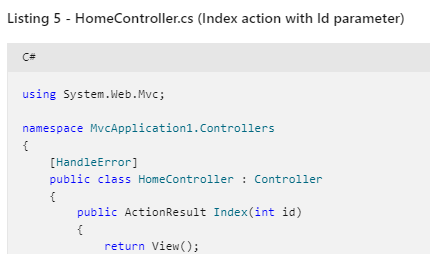

# Read: 14 - Routing and Navigation Properties
# ASP.NET MVC Routing
- The ASP.NET Routing module is responsible for mapping incoming browser requests to particular MVC controller actions
- ASP.NET Routing is enabled in your application's Web configuration file (Web.config file)
- There are four sections in the configuration file that are relevant to routing: 
     - the system.web.httpModules section.
     - the system.web.httpHandlers section.
     - the system.webserver.modules section.
     - and the system.webserver.handlers section.
- a route table is created in the application's Global.asax file : which  is a special file that contains event handlers for ASP.NET application lifecycle events.

### Listing 1 - Global.asax.cs

- When an MVC application first starts, the Application_Start() method is called. This method, in turn, calls the RegisterRoutes() method. The RegisterRoutes() method creates the route table.
- The default route table contains a single route (named Default). The Default route maps the first segment of a URL to a controller name, the second segment of a URL to a controller action, and the third segment to a parameter named id.

**Imagine that you enter the following URL into your web browser's address bar:**

/Home/Index/3 ---> The Default route maps this URL to the following parameters:

- controller = Home

- action = Index

- id = 3

### Listing 2 - HomeController.cs

### Listing 3 - HomeController.cs (Index action with no parameter)

### Listing 4 - HomeController.cs (Index action with nullable parameter)

### Listing 5 - HomeController.cs (Index action with Id parameter)

# Routing in ASP.NET Core
