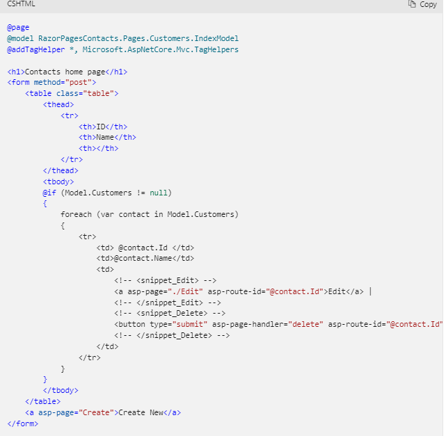
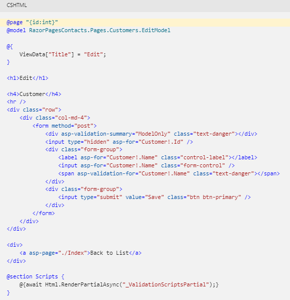
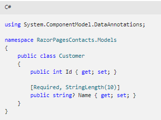

# Read: 31 - Razor Pages
## Introduction to Razor Pages in ASP.NET Core
-  can make coding page-focused scenarios easier and more productive than using controllers and views.
-  Create a Razor Pages project:
      - Program.cs: builder.Services.AddRazorPages();
      - app.MapRazorPages(); 
      - adds services for Razor Pages to the app.
      - adds endpoints for Razor Pages to the IEndpointRouteBuilder.
      - Consider a basic page:
@page

```
<h1>Hello, world!</h1>

<h2>The time on the server is @DateTime.Now</h2>
```

     - @page makes the file into an MVC action, which means that it handles requests directly, without going through a controller. @page must be the first Razor directive on a page. @page affects the behavior of other Razor constructs. Razor Pages file names have a .cshtml suffix.
     
- the PageModel class file has the same name as the Razor Page file with .cs appended. For example, the previous Razor Page is Pages/Index2.cshtml. The file containing the PageModel class is named Pages/Index2.cshtml.cs.
- 
- the PageModel class is called <PageName>Model and is in the same namespace as the page.
  
### Homa Page
  
  
  
### Edit File
    
### Validation


## Why Razor Pages?
  - It’s easier to get to web development for beginners as Razor pages are more lightweight than MVC. Besides beginners there are people who are coming from other scripting languages be it old ASP or PHP or something else.
  
- Razor Pages fit well to smaller scenarios where building controllers and models as separate classes is overkill.
  
  ### Getting started with Razor Pages
  
  [Getting started with Razor Pages](https://docs.microsoft.com/en-us/aspnet/core/tutorials/razor-pages/razor-pages-start?view=aspnetcore-6.0&viewFallbackFrom=aspnetcore-2.1&tabs=visual-studio)
  
  
  
