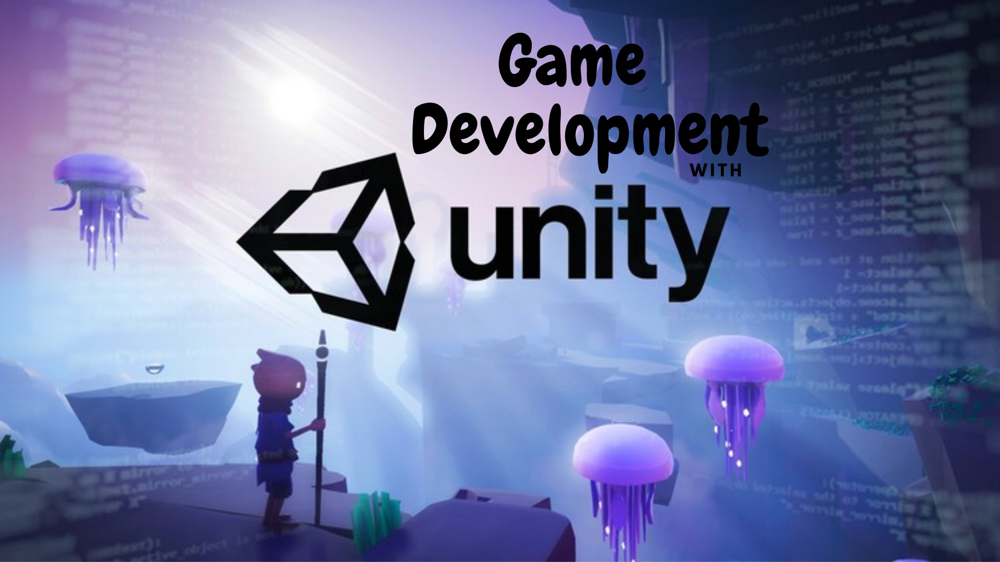

# Read: 41 - Unity

## What is Unity?

- Unity is the tool used by a large number of game developers to create and power their creations. Unity software is powerful, extremely easy to use, and free until you start making the big bucks.
- professional tool used by some of the biggest names in the industry.
- Unity is a 3D/2D game engine and powerful cross-platform IDE for developers. Let’s break down what this means.
- Unity is able to provide many of the most important built-in features that make a game work. That means things like physics, 3D rendering, and collision detection. 

Unity, considered to be one of the Best Game Engines, is a popular, powerful, and versatile engine allowing you to create 2D, 3D and multiplayer games across a large number of platforms. Even with limited or no coding experience, you can quickly gain the skills to build games using the Unity Editor and C#. Below, we’ve compiled some of the best Unity tutorials available for beginners to get you programming with C# and working with this amazing game engine.

[FULL TOTORIAL](www.tutorialspoint.com/unity/unity_quick_guide.html)
