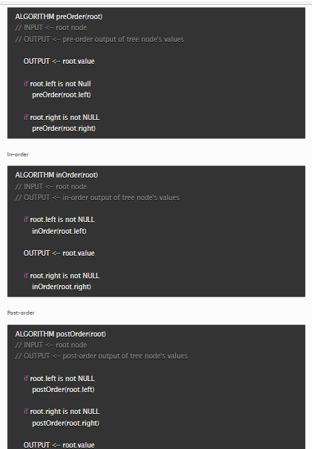

# Read: Trees

A tree is a data structure that is non linier like a list but that uses nodes starting at a root then then point to more than one "next" node. This allows for them to solve an incredibly amount of problems that would become more expensive to solve. For example in a binary search tree you could easily find the kth smallest element.

# Common Terminology

``` 
- Node - A Tree node is a component which may contain its own values, and references to other nodes
- Root - The root is the node at the beginning of the tree
- K - A number that specifies the maximum number of children any node may have in a k-ary tree. In a binary tree, k = 2.
- Left - A reference to one child node, in a binary tree
- Right - A reference to the other child node, in a binary tree
- Edge - The edge in a tree is the link between a parent and child node
- Leaf - A leaf is a node that does not have any children
- Height - The height of a tree is the number of edges from the root to the furthest leaf.

```
Sample Tree


# Traversals
An important aspect of trees is how to traverse them. Traversing a tree allows us to search for a node, print out the contents of a tree, and much more! There are two categories of traversals when it comes to trees:

- Depth First
- Breadth First

## Depth First

Depth first traversal is where we prioritize going through the depth (height) of the tree first. There are multiple ways to carry out depth first traversal, and each method changes the order in which we search/print the root.
- Pre-order: root >> left >> right
- In-order: left >> root >> right
- Post-order: left >> right >> root



# Binary Trees
In all of our examples, we’ve been using a Binary Tree. Trees can have any number of children per node, but Binary Trees restrict the number of children to two (hence our left and right children).

There is no specific sorting order for a binary tree. Nodes can be added into a binary tree wherever space allows.

# Adding a node

- Because there are no structural rules for where nodes are “supposed to go” in a binary tree, it really doesn’t matter where a new node gets placed.

- One strategy for adding a new node to a binary tree is to fill all “child” spots from the top down. To do so, we would leverage the use of breadth first traversal. During the traversal, we find the first node that does not have 2 child nodes, and insert the new node as a child. We fill the child slots from left to right.

- In the event you would like to have a node placed in a specific location, you need to reference both the new node to create, and the parent node upon which the child is attached to.

# Big O

- The Big O time complexity of a Binary Search Tree’s insertion and search operations is O(h), or O(height). In the worst case, we will have to search all the way down to a leaf, which will require searching through as many nodes as the tree is tall. In a balanced (or “perfect”) tree, the height of the tree is log(n). In an unbalanced tree, the worst case height of the tree is n.

- The Big O space complexity of a BST search would beO(1). During a search, we are not allocating any additional space.

